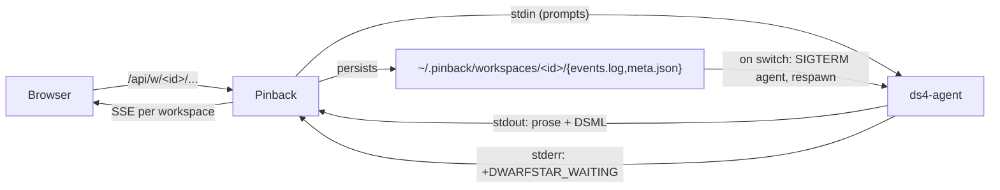

# Pinback Architecture (v0 — ds4-agent GUI)

## Decision

Pinback is a small C99 frontend daemon plus a static web UI bundle that
gives non-CLI users a reliable cockpit on top of `ds4-agent`. It runs on
the same machine as the agent and exposes a browser-friendly local URL.
The same daemon is the remote-access endpoint for users who want to
reach their agent from another device through WireGuard+Caddy or
Tailscale Funnel.

This is a pivot from the previous "pinback fronts ds4-server" plan.
Real users want a GUI for the *agent* — the thing that streams prose,
emits DSML tool calls, and edits files in a working directory — not for
the raw model server. The earlier ds4-server design has been replaced.
The HTTP server, CSP wiring, event log, smoke harness, Shiki+Oniguruma
embedding, and DSML/fence rendering all carried over unchanged. The
upstream HTTP/SSE client and the chat-completions terminology did not.

The failure modes from prior demos are still binding: stale SSE
cursors, ambiguous session state, noisy error rendering, weak
observability. They are the regression targets for this build.

## Product Goal

Pinback is a local-first ds4-agent cockpit. It must feel like a thin,
fast control surface over a single coding agent, not a generic chatbot
UI. The first release optimizes for reliability, low latency, honest
state, and debuggability over visual novelty.

Mental model (locked):

> `cd <workspace> && claude` — one agent at a time, in one workspace.
> Switching workspaces tears the agent down and respawns it under
> `--chdir`. Pinback owns the workspace catalog so switches are 1–2 s,
> not "lost work."

## Grounding In ds4-agent

This plan is written after reading `ds4-agent`'s source. Concrete facts
that shape it:

- `ds4-agent` is a single static C binary that loads a GGUF model and
  runs a coding agent loop. It supports two modes: an interactive TUI
  (linenoise-driven) and `--non-interactive`, where stdin lines are
  treated as user prompts and stdout streams the model's reply
  word-by-word.
- The supported CLI surface is `--non-interactive`, `--chdir <path>`,
  `--model <gguf>`, plus a small set of internal env vars
  (`DS4_METAL_*_SOURCE`) that point at the Metal kernel sources.
- In `--non-interactive` mode `ds4-agent` emits a stderr marker
  `+DWARFSTAR_WAITING` whenever it returns to idle (model loaded, or a
  turn finished). pinback uses this as the canonical turn-end signal.
- Slash commands (`/save`, `/switch`, `/clear`, …) are honored *only*
  in the interactive TUI. In `--non-interactive` they are user prompts
  that the model interprets as text. v0 therefore does not rely on
  `/save` or `/switch` at runtime; the architectural shape that needs
  them is wired but disabled (see "Deferred" below).
- `ds4-agent` resolves Metal kernel paths relative to `argv[0]`, so
  pinback resolves the binary's absolute directory at spawn time and
  exports `DS4_METAL_*_SOURCE=<absdir>/metal/<kernel>.metal` before
  `execvp`. Without this, `--chdir` breaks model load.
- Tool calls are emitted in DSML, an XML-like wrapper:
  `<｜DSML｜invoke=tool>...</｜DSML｜tool_calls>` and
  `<tool_result>...</tool_result>`. The browser already parses these.
- `~/ds4` is read-only for pinback. We consume only the public CLI.

## Architecture



`pinback-server` is the only binary noobs run. The web bundle is
embedded at build time (`xxd -i` over `index.html`, `app.js`,
`vendor/shiki/shiki.mjs`, `vendor/shiki/onig.wasm`). No runtime
fetches, no proxy, no separate UI process.

Invariants:

- Exactly one `ds4-agent` child at any moment.
- Each workspace owns exactly one conversation slot.
- Reset = wipe slot, agent respawns fresh in the same dir.
- All UX gaps default to "what does Claude Code do today."

## Modules

| File | Role |
| --- | --- |
| `src/pinback.c` | argv, init, signal wiring, agent + workspace lifetimes |
| `src/http.c` | HTTP/1.1 server, CSP, request-id, SSE fan-out |
| `src/handlers.c` | `/api/w`, `/api/w/<id>/{events,input,control,activate}`, `/api/runtime`, `/healthz`, `/readyz`, `/metrics` |
| `src/workspace.c` | catalog at `~/.pinback/workspaces.json`, atomic writes, per-workspace dir, meta.json mirror |
| `src/agent.c` | fork/exec ds4-agent, stdio pipes, ANSI strip, state machine, DSML/prose/turn-end classifier |
| `src/event_log.c` | per-workspace ring + on-disk JSONL append + subscriber set, resume by `(generation, seq)` |
| `src/util.c` | JSON helpers, base64, atomic write, monotonic clock |
| `src/log.c` | structured JSONL logger to stderr |
| `src/static_assets.c` | `xxd`-generated embedded UI bundle |
| `web/index.html`, `web/app.js` | shell, fence parser, DSML panel, workspace picker |
| `tools/fake-ds4-agent.c` | deterministic CLI that mimics real agent for tests |
| `tools/pinback-smoke` | black-box smoke against fake agent |
| `tools/pinback-e2e` | exercise against real ds4-agent |

## URL surface

Teleport-friendly from day one. Workspace ids are stable opaque
strings, so a future export/import packet is just `workspaces.json` +
the per-workspace `events.log` + `meta.json`.

- `GET  /api/w` → list workspaces + active id
- `POST /api/w` `{path,label?}` → create + persist; does NOT activate
- `POST /api/w/<id>/activate` → tear down current agent, spawn new
  agent with `--chdir <path>`; ack when ready
- `GET  /api/w/<id>/events?after=N` → SSE for that workspace; serves
  on-disk backlog from `events.log`, then live tail
- `POST /api/w/<id>/input` `{text}` → 202 if `<id>` is active, 409 otherwise
- `POST /api/w/<id>/control` `{op:"abort"|"reset"|"save"}`
- `DELETE /api/w/<id>` → archive under `_trash/<id>` for recovery
- `GET  /api/runtime` → adds `active_id`, `agent.state`, restart counters
- `GET  /healthz`, `/readyz`, `/metrics` — unchanged

Single-active enforcement lives in `handlers.c`. `agent.c` never sees
workspace ids — it only knows "current".

## Agent supervisor

State machine: `IDLE → SPAWNING → READY → BUSY → READY` (or
`→ DRAINING → IDLE` on switch/shutdown).

Spawn (per workspace activate):

```
pid = fork();
exec("ds4-agent", "--non-interactive",
                  "--chdir", ws.path,
                  "--model", model_path);
```

…with `DS4_METAL_*_SOURCE` env exports derived from the resolved
absolute path of `argv[0]`.

Pipes: stdin (write), stdout (read+classify), stderr (line-buffered).

The reader threads classify into events emitted via
`pin_event_log_append`:

| event kind | source | trigger |
| --- | --- | --- |
| `user` | request | `POST /api/w/<id>/input` accepted |
| `answer` | stdout | UTF-8 chunk after ANSI strip, until DSML/turn boundary |
| `tool_call` | stdout | parsed `<｜DSML｜invoke=tool>…</｜DSML｜tool_calls>` |
| `tool_result` | stdout | parsed `<tool_result>…</tool_result>` |
| `agent.save_sha` | stdout | regex on `/save`-style ack lines (future-pty hook) |
| `answer_end` | stderr | `+DWARFSTAR_WAITING` while state is `BUSY` |
| `agent.state` | internal | every state transition (spawning, ready, dead) |
| `agent.error` | classifier or wait | parse failure or non-zero exit |

Switch sequence (atomic):

1. (Future-pty hook) write `/save`, wait for SHA. *Disabled in v0;
   see "Deferred" below.*
2. Persist any captured `session_sha` for the old workspace.
3. SIGTERM, wait 3 s, SIGKILL on timeout.
4. Drain reader threads, close pipes.
5. Spawn fresh agent in the new workspace dir.
6. (Future-pty hook) if destination has `session_sha`, write
   `/switch <sha>`. *Disabled in v0.*
7. Flip `active_id`, broadcast `runtime` snapshot.

Reset: same as switch but skip step 1, wipe `events.log` and
`session_sha` before spawn.

`+DWARFSTAR_WAITING` is also emitted on initial spawn (not just
turn-end). The classifier suppresses turn-end events unless the agent
is in `BUSY`, so the boot signal does not produce a spurious
`answer_end`.

## Event log — per workspace

Each workspace owns its own ring buffer + on-disk JSONL file +
subscriber set. The fan-out and resume code is unchanged. Snapshots
are keyed `(workspace_id, generation, seq)`.

`generation` increments on agent respawn so subscribers can detect a
truncation/reset and rewind their cursor without ambiguity.

## Web UI

The header has a workspace picker (Claude-Code-style: list with path +
label, "+ New", "Reset", "Delete"). No "chat / agent" toggle — agent
mode is the only mode.

- `EventSource` URL is `/api/w/${activeId}/events` and reconnects on
  `activate` ack.
- Submit POSTs `/api/w/${activeId}/input`.
- Each agent turn renders as a sequence of segments: prose,
  fenced-code (Shiki), DSML panel.
- Empty workspace shows the working dir + "type a message to start".

CSP is `script-src 'self' 'wasm-unsafe-eval'`, no inline scripts.
Shiki ships with WASM Oniguruma at `/vendor/shiki/onig.wasm`
(`application/wasm`).

## Build / single-binary

`tools/gen-static-assets.sh` regenerates the embedded `*.h` from
`web/` and `web/vendor/`. Run it after every web change.
`pinback-server` is a single statically-linkable binary. No runtime
fetches in v0.

## Tests

- Unit (`tests/`): workspace store atomic write+load+corruption,
  agent supervisor spawn/switch/reset against fake agent, per-workspace
  event log, util, http.
- Smoke (`tools/pinback-smoke`): create/activate/reset/switch-back,
  409 on inactive input, CSP+SSE+Shiki asset reachability,
  long-markdown render fixture.
- E2E (`tools/pinback-e2e`): real ds4-agent in two scratch
  workspaces, real model, real Metal load, full turns on A and B,
  switch tears down A, inactive A returns 409, reset clears state.

## Deferred — v0 limitations of note

- **Session resume across workspace switches.** ds4-agent's
  `--non-interactive` mode does not honor `/save` or `/switch`. v0
  ships with the architecture wired but the runtime dance disabled
  (`save_timeout_ms = 0`). Re-enabling requires a pty-based supervisor
  that drives the interactive TUI loop. Tracked in `docs/todo-paint.md`.
- macOS `.app` wrapper, parallel agents, per-workspace model selection,
  ssh:// / sftp:// remote workspaces, Shiki bundle shrink, advanced
  diff viewer, full teleport export/import packet, and UX rails over
  the workspace primitive. All in `docs/todo-paint.md`.
